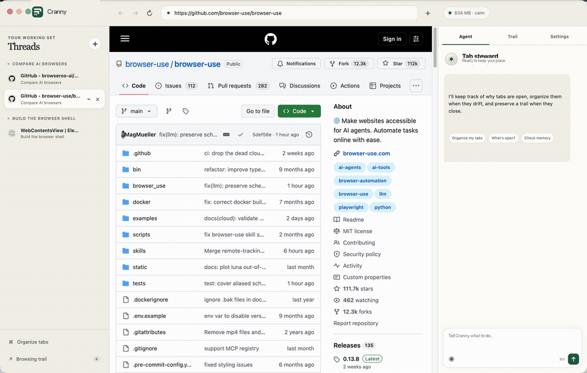

# Cranny


**A local-first browser that remembers why your tabs are open—and catches what would otherwise slip through the cracks.**



## Why the world needs another browser

Browsers remember addresses, not intent. Tabs become a fragile to-do list: they consume memory, but closing them feels like throwing work away. Most AI browsers add a chatbot without changing that underlying model.

Cranny makes the **intent behind your work** the primary object:

- Attach intent to tabs and organize around what you are doing.
- Turn closing into a save operation with a searchable local trail.
- Watch real memory pressure and hibernate background tabs safely.
- Ask one bounded agent to act across the browser, not just discuss a page.

The bet is simple: people should be able to keep their train of thought without keeping every tab alive.

## What works today

- Real sandboxed Chromium tabs in a minimal macOS shell.
- Intent-based grouping, duplicate cleanup, pinning, closing, and hibernation.
- A local trail containing URLs, titles, intent, timestamps, and optional excerpts.
- Live memory monitoring with reversible “make room” actions.
- Built-in commands that need no API key.
- Optional Claude, OpenAI, OpenAI-compatible, and Ollama reasoning.
- Browser-only agent tools—no filesystem or terminal access.

## Run it

Requires macOS, Node.js 22+, and npm.

```bash
git clone https://github.com/y12uc231/cranny.git
cd cranny
npm install
npm start
```

To launch it later as `cranny`:

```bash
npm link
cranny
```

Shortcuts: `⌘L` address bar · `⌘T` new tab · `⌘W` archive and close · `⌘K` agent

## Try asking

```text
Organize my tabs
Set this tab intent to compare agent browsers
What tabs do I have open?
Save memory
Find context compaction in my journal
```

Core tab and memory commands run locally. Configure a model in Settings for page summaries, cross-tab reasoning, navigation, and interaction with visible page controls. API keys use the OS keychain when available.

## Project notes

This is a development MVP, not yet a daily-driver Chrome replacement. The next milestones are packaged builds, downloads and permissions, profile import, and confirmation gates for consequential page actions.

- [Product thesis and roadmap](docs/PRODUCT.md)
- [Architecture](docs/ARCHITECTURE.md)
- [Prior art](docs/PRIOR_ART.md)
- [Security model](docs/SECURITY.md)

```bash
npm test
npm run check
```

Source available under the [PolyForm Shield License 1.0.0](LICENSE). It does
not permit using this code to provide a competing product; see
[commercial licensing](COMMERCIAL-LICENSING.md) for separate permission.

## A weekend side project

I'm building Cranny as a side project on weekends. It started from a simple feeling: there should be a good, usable browser that helps people manage their work instead of making them manage their tabs.
